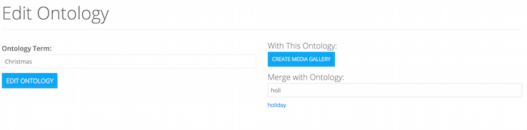

# Managing Ontology

> This guide explains the basics of tag/taxonomy/ontology management, from creating new ontology terms, building NLP rules for terms and configuring access to build and maintain existing ontologies.

## Merging Ontology
You can combine any ontology into a single term by utilizing the "Merge With" feature when editing an ontology term.  To begin, go to Admin -> Ontology in the nav and then find the term you wish to be the canonical term by clicking .

.
