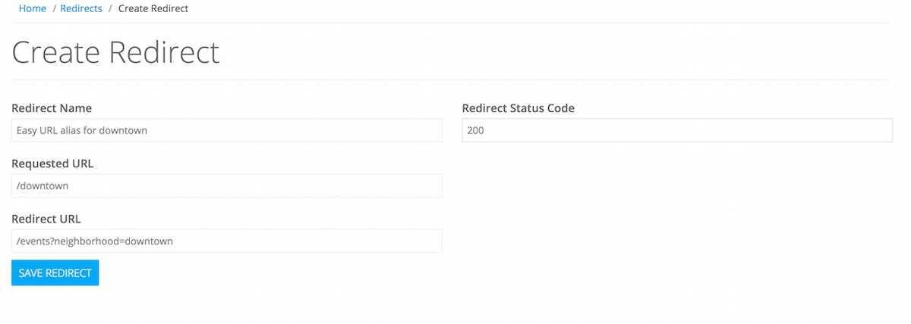

# Managing Redirects

> This guide explains how to set up server redirects for specific endpoints.  These can be useful when migrating from another service or creating non-canonical aliases for other endpoints.

The redirects page can be found under the Admin heading:

The primary purpose for creating redirects in the admin is to deal with not-found pages from existing solutions in order to mitigate short-term SEO impact on the migration to Pointslocal.  These can also be used to create duplicate aliases without needing to replicate the stream.  As an example, if you wanted the endpoint /downtown to redirect to /events?neighborhood=downtown, creating an alias would provide a handy way to link to those search results.



Creating a redirect requires a source and a destination.  

The source must start with / and must not be an existing stream rewrite.  For example, if you had a stream called Events with an endpoint of /events and then created an alias for /events to go to /home, it would never reach that point.  A redirect requires that the initial request is not found to pass through.

The destination can be an absolute (http://example.com) or relative (/home) URL.  If you create a relative path, the site will first check that it is a valid endpoint, otherwise it may introduce a redirect loop.

The status code is optional, and will return ```302 Found``` header.   Because clients will often indefinitely cache ```301 Moved Permanently```, you should make certain that it's not a URL you intend to use going forward and that it maps to an existing endpoint on or off your site.  At this time the redirects feature does not include the ability to specify ```Cache-Control``` or ```Expiry``` headers.