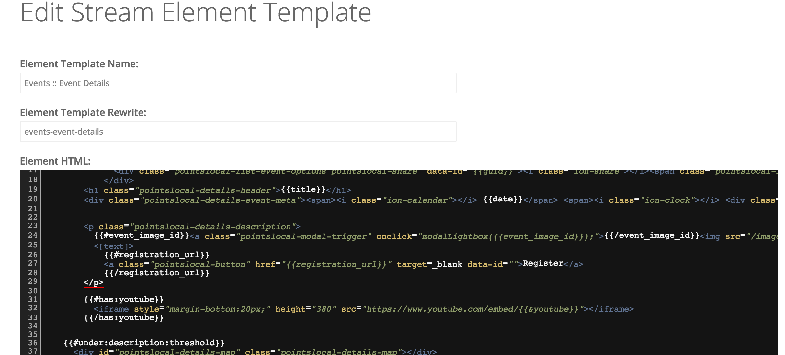

# Components / Element Templates

> Element templates represent individual display components for the front end of your site.  From event listings to box scores to stories, the element templates section enables modular design of your pages and works in congress with the stream designer to help you visually design the display of every piece of your site.

## Editing Element Templates


## Displaying Variables and Using Logic
Element templates rely on one of two templating languages - Pointslocal's built-in language and/or Mustache.  You can use Mustache parsing and still fallback to the Pointslocal default, but there may be conflicts and rendering may be unreliable.

This guide won't discuss the details of Mustache, you can read about the logic-less template language <a href="https://mustache.github.io/">here</a>.  A tldr;, though: variables are presented as ```{{variable}}```, loops are expressed as ```{{#aloop}}{{innerloop_variable}} - {{innerloop_variable}}{{/aloop}}``` and boolean/existing value checks are expressed as ```{{#variable}}Great!  We have {{variable}}{{/variable}} {{^variable}}No variable :{{/variable}}```.

Pointslocal's templates work somewhat similarly except some logic capabilities exist and templates are expressed in ```<[variable]>``` format.  In almost all cases, Mustache will suffice for presentation and a lot of what exists here is overkill for many applications.

* ```<[variable]>``` - Simple variable output

* ```{{&[URL-PARAMETER]}}``` - Allows injecting query parameters from the URL, like {{&page}} or {{&search}}

* ```{{api->[ENDPOINT].(each|one)}} ... loop {{end}}{{else}} no items{{end}}``` - Allows direct API calls from templates. ```{{api->games?team=stanford.one}}one stanford game{{end}}{{else}}No stanford games{{end}}

* ```{{exists([SOME VALUE])}} ... if it exists {{end}}{{else}} ... if it does not{{end}}``` - A simple value check which can contain any value or variable

* ```{{if([SOME TEST])}}Passed test{{endif}}``` - Enables some logical tests for existence or value.  Some examples:
  * ```{{if(<[title]>)}}<[title]>{{endif}}```
  * ```{{!if(<[title]>)}}No title{{endif}}```
  * ```{{if(<[fouls]> > 4)}}Fouled out in basketball{{endif}}```
  * ```{{if(<[fouls]> = 5)}}Also will show fouled out{{endif}}```

## Finding Available Variables
Almost all content types share some common variables like ```{{title}}```, ```{{description}}``` and ```{{guid}}```, but to find all available template variables and their type, simply include a ```{{@explain}}``` variable, which will output all variables and type in a table.  Since these will only be visible on the site, this is ideally not used on production pages.

## Setting Global Variables In Element Templates
Any value can be set in both element templates using the following syntax:

```@set("name",value)```

This is useful for transferring information from stream components to the template at large, particularly for SEO.  A common example is setting page metadata from within the details of a page:

```@@set("page_title",{{title}})```

Which allows ```<[var:page_title]>``` to be accessed from other components and the overall header/footer stream template.