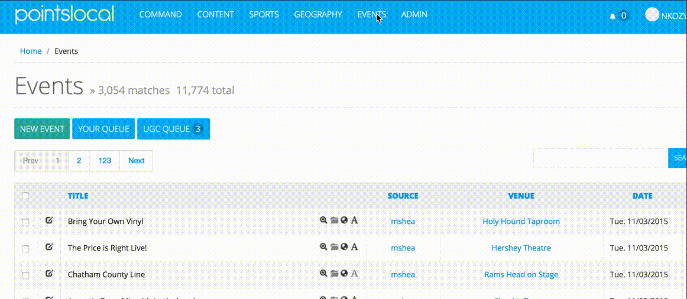
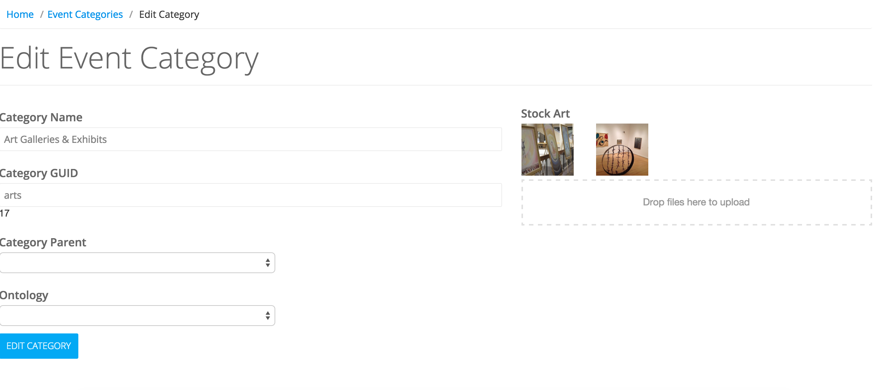
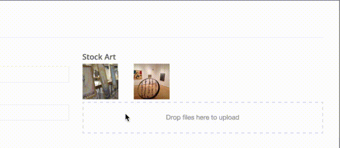

# Managing Categories
> This guide explains the management and customization of categories inside the Pointslocal events platform.

# The Categories List
To access the list of event categories, select **Event Categories** under Events in the top-level navigation.


The list will provide a few actions and pieces of information about each category. From here you can edit or delete a category, see how many events are currently in the system classified under that category and see the category's parent category.

Clicking on the number under Events column will take you to the events list page filtered to that category.

# Editing a Category
When editing a category, you have access to modify the category from the top down.  The name, GUID (useful for SEO purposes) and the hierarchical parent category can be modified directly.  Choosing an Ontology from the dropdown will provide some additional hinting for natural language processing.  This can help automatically tag or suggest categories for user-submitted events.



# Modifying Stock Art (optional)
When displaying your events you may choose to utilize stock art on events that have no images associated with them. In this case, you may yield to Pointslocal stock art or supply our own.

To add categorical stock art to a category, simply click or drag files onto the box labeled "Drop files here to upload." To delete existing stock art, hover over an image and click the ```x``` icon to remove it.


