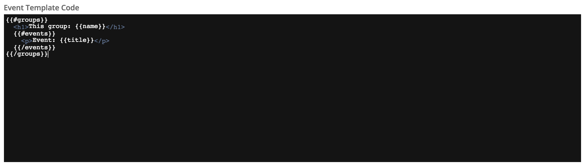
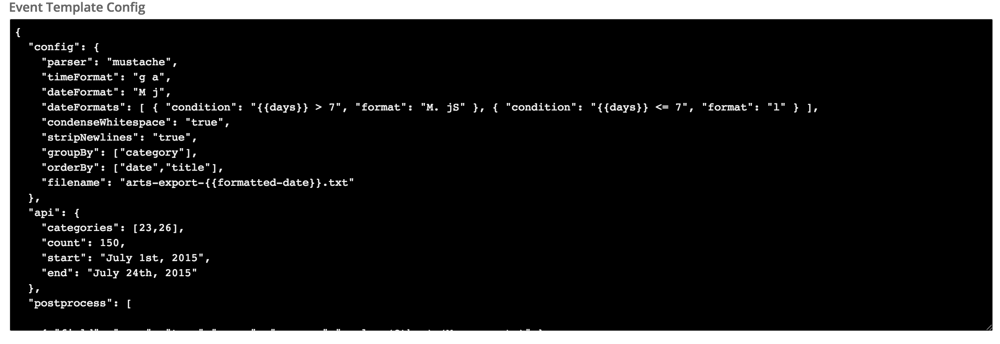
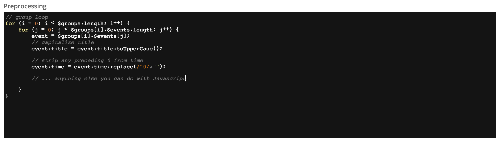
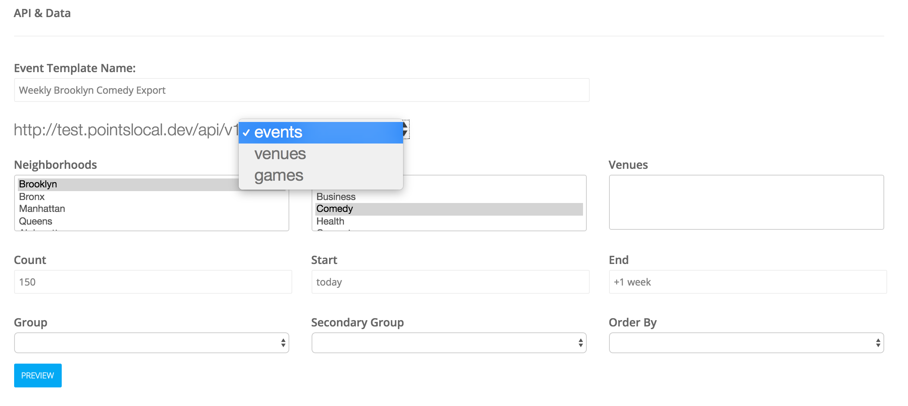
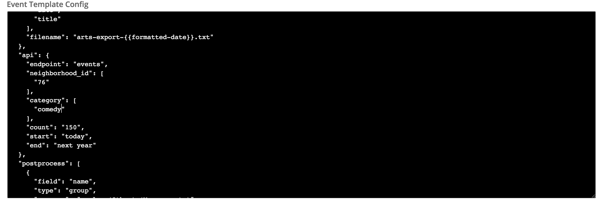
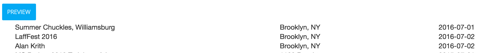

# Exporting Events
> This guide will show you how to get your events out of Pointslocal, for use in another CMS, for syndication or for reverse print publication.  While this guide goes into some of the deeper aspects of scripting and templating, in many cases it should be possible to construct exports with very little technical expertise.

Getting event data _in_ to Pointslocal involves a number of different types of variable formats and processes.  At some point you may be interested in getting that data _out_, possibly for print exports or integrations with another calendar system. Exporting all data (including Events) is handled by way of two components:

  - A formatted export template
  - An export configuration
  - Optional Javascript pre-processing

Export templates are accessed through any given top-level navigation area and then the Data Export secondary navigation item.

On nomenclature:

  - *Event Template Code*: The template for output, which should match the target's format, often a CMS.  This can be any text format and relies on the Mustache parsing language, desribed below.
  
  - *Event Template Config*: A general configuration JSON document that tells the output process what data to get and how to group and sort it.  This is a soft wrapper around our API calls.  It should be stressed that this can be built entirely by using the selection tools at the top of the page.  More on that below:
  
  - *Preprocessing*: Optional Javascript section for manipulating data before it is parsed.  This might entail evaluating addresses to truncate state abbreviations or changing 9:00 A.M. to 9 am to match style.
  
  - *Output*: A collection of methods for delivery (email, FTP, SFTP, Download, Amazon S3, Dropbox)
  - *Schedule*: An optional schedule for output, taking any number of dates and a time.

*The Event Template Config section* normalizes an API call.  As an example, if you wanted to look for events in the next week, your API call might look like this:

```http://yoursite/api/v1/events?start=today&end=+1%20week```

In the config this denormalizes as:

```
{ api: {
    start: 'today',
    end: '+1 week'
  }
}
```

While much of this is handled through the visual selectors, it can be easy to translate an existing API call to a template configuration.

## Building a Request
Producing the actual content you wish to export is handled through one of two mechanisms:

- A standard API call
- Hand selecting events for export in your queue

You can override any API request with your local queue.  So if your export is set to call ```/events``` with a start of ```today``` and an end of ```next week``` and you export with a queue of non-matching events, it will yield to the latter.

To build an API call, from the edit or create export screen you can select your endpoint, which will then show you the optional parameters you can use to compile the data you would like.



In the example above, by selecting any of the options associated with the API, you will automatically build a configuration file.  



To see if this data meets expectations, hit the preview button:



## Export Templates
An export template represents the desired format for outputting the data.  An example may be an HTML or XML format.  More frequently, though, it relates to a print system's format.  Pointslocal can accommodate almost any format that is _text-based_ and in some cases binary formats as well, although this is less common and not officially supported.

The basis of almost all templating in Pointslocal is the Mustache format.  This allows for the injection of variables, loops of arrays and objects and conditional responses.  Mustache documentation can be found HERE, but here are a few simple examples:

**Loops**
```
{{#events}}
  <b>{{event_title}}</b>
{{/events}}
```

**Conditionals**
```
{{^events}}
  <strong>No events</strong>
{{/events}}
```

**Putting It Together**
```
{{#groups}}
  <h2>{{group_name}}</h2>
  {{#events}}
    <b>{{event_title}}</b>
    {{#event_venue_phone}}Phone: {{event_venue_phone}}{{/event_venue_phone}}{{^event_venue_phone}}No phone!{{/event_venue_phone}}
  {{/events}}
{{/groups}}
```

### Export Template Variables
For events, all requested items are grouped in some way specified by configuration.  Often this is done by venue, date or category.  When a grouping type is declared in the configuration, there are context-specific variables available, but all will receive at least a variable of ```{{name}}```, which generally represents the most likely to be displayed variable.  For example, venues would have the venue name as the name, dates would have the date in January 1, 1900 format and categories would simply output the category name.

#### Group Variables - Venues
  - **name** ```string``` Venue's name
  - **address** ```string``` Venue's physical address
  - **latitude** ```float``` Lat coordinate for address
  - **longitude** ```float``` Lon coordinate for address
  - **phone** ```string``` Venue's phone number

Within event items these are all present, prefaced by **event_venue_** For example, **event_venue_phone**

#### Group Variables - Dates
  - **name** ```string``` Date in January 1, 1900 format
  - **timestamp** ```int``` Unix timestamp
  - **date** ```string``` If group-date-format is specified in config, formats the date accordingly

#### Group Variables - Categories
  - **name** ```string``` Category's name as defined under Events :: Event Categories

#### Group Variables - Neighborhoods
  - **name** ```string``` Neighborhood name as defined under Geography :: Neighborhoods

#### Event Item Variables
  - **title** ```string``` Event's overall title.  If defer_print_title is set to true in the configuration, this will represent a print title.
  - **print_title** ```string``` If a print title exists, its value will be output with this variable.
  - **description** ```string``` The event's description.  If defer_print_description is set to true in configuration, that value will be represented here instead.  If a truncate_chars configuration option is set, the description will be truncated at X characters.  If truncate_words is set, this will be broken at a character length but not mid-word.
  - **start_date_fmt** ```string``` Date using config-specific format.
  - **end_date_fmt** ```string``` End date using config-specific format.
  - **start_time** ```int``` Start time in Unix epoch timestamp.
  - **end_time** ```int``` End time in Unix epoch timestamp.
  - **start_time_fmt** ```string``` Start time in config-specific format.
  - **end_time_fmt** ```string``` End time in config-specific format.
  - **has_start** ```bool``` If an event has a start time.  This usually represents an all-day event.
  - **has_end** ```bool``` If an event has a specific end time.  These last two variables are usually used in conditional checks.
  - **phone** ```string``` Event-specific phone number.
  - **url** ```string``` Event-specific URL.
  - **submitter** ```string``` Email address of user that submitted the event.
  - **email** ```string``` Contact email for event.
  - **published** ```bool``` If event is set to web published.
  - **print_published** ```bool``` If event is set to print published.
  - **tags** ```array``` A collection of tags associated with event.
  - **categories** ```array``` A collection of categories that the event belongs to
    - **event_category_name**
    - **event_category_guid**
  - **neighborhoods:** ```array``` A collection of neighborhoods that encompass the event's coordinates
    - **neighborhood_name**
    - **neighborhood_guid**
    - **neighborhood_latitude**
    - **neighborhood_longitude**
  - **event_venue_name** ```string``` Name of the event's venue, if applicable.
  - **event_venue_url** ```string``` URL of venue.
  - **event_venue_address** ```string``` Address of venue.
  - **event_venue_phone** ```string``` Phone number of venue.
  - **event_venue_description** ```string``` Description or short summary of venue.

## Export Configuration
At the top of the export template edit page there is a group of options that allow you to select the precise type of data you wish to export.  Using this process constructs a configuration for the export process itself.

After selecting the options that describes the data you wish to export, you can preview that and see some of the data that's returned by the API.  Note that this is not grouped but is sorted.  This section exists to give insight into what the export call will produce.

If you use this process, there's no need to do any manual editing of the JSON configuration.

The configuration itself is a JSON document; if the JSON is invalid the entire config will be bypassed, so it makes sense to validate your JSON against a JSON linter.  In most cases these configurations will not be modified after an initial setup.

The document itself specifies desired formats, API options and export options broken down into the following sections

- API
- Configuration
- Outputs

####API
  - **type** Specifies the type of data you'd like to access. For events it's simply 'events'.
  - **count** The number of events to return.  This defaults to 100.
  - **categories** ```array``` Accepts an array of either category GUIDs or IDs (found under Events :: Events Categories)
  - **neighborhoods** ```array``` Accepts an array of either neighborhood GUIDs or IDs (found under Geography :: Neighborhoods)
  - **published** ```bool``` If set to true, will only show events set to web published.  If unset will show all events.
  - **print_published** ```array``` If set to true, will only return events set to print published. If unset all events will be returned.
  - **start** Uses a fairly tolerant natural language value to describe the first date to return events.  Examples: "this Wednesday" or "tomorrow" or "Feb 5, 2015"
  - **source** ```string``` The event's source, as visible in the events list itself.
  - **user** ```string``` The username of the user that created the event.
  - **end** Same as **start**, but for the end of the range

####Configuration
  - **dateFormat** Specifies the format for all dates
  - **dateConditions** ```array``` A list of conditions on date values with respective date formats. This allows for varying date formats based on temporal conditions. The most common example is outputting Monday for days in the next week and Jan 1 for days beyond that.
  - **timeFormat** Specifies the format for all times
  - **timeConditions** ```array``` A list of conditions as with **dateConditions** but applying to time values.

####Outputs
  - **ftp** Sends file via FTP.
    - **host**
    - **port**
    - **user**
    - **pass**
  - **sftp** Sends file via SFTP.
    - **host**
    - **port**
    - **user**
    - **pass**
  - **download** Creates downloaded file from browser.
    - **filename**
  - **email** Sends file via email.
    - **recipients** ```array```
    - **subject**
    - **body**

####Post-processes
  > Post-process fields take the following options: a field, an element type, and the process command.  An example:

  ```{ "field":"event_title", "type":"item", "process": "propercase" }```

  > In the above example, a title of ```LADIES DRINK FREE``` would become ```Ladies Drink Free```
  
  **Options:**

  - **trim** - Removes extra whitespace characters (spaces, tabs, newlines)
  - **striplines** - Removes all line feed / carriage returns.
  - **uppercase** - Converts text to uppercase
  - **lowercase** - Converts text to lowercase
  - **time(format)** - Treats text like datetime and allows formatting
  - **propercase** - Converts text to propercase / titlecase
  - **decodeEntities** - Removes XML encoding
  - **replace**
    - **find**
    - **replace**
    **Special Characters** - find can accept special characters that represent character types: #space#, #digit#, #nl# #hex(hexadecimal value)#

### Using Javascript Directly
> It's possible to have the export process generate Javascript objects that you can use to produce your output directly.  When you choose to use Javascript as a templating language, the export process will create the following object:

```javascript
{ $groups: [ $events: [] ] }
```

> That will contain the same variables as described above.

This functionality automatically includes underscore.js, enabling you to make use of its vast library of invaluable array and mapping methods.  It also includes Mustache.js, allowing both the use of the same templating language along with direct data manipulation.  For using dates and times, we package in [moment.js](http://momentjs.com/)moment.js as well.


Here is a very basic example of how to produce some variable content, which ignores any event that contains the word "cancel" in its title:

```javascript
var events = [];
for(var i = 0; i < $groups.length; i++) {
  for (var j = 0; j < $groups[i].$events.length; j++) {
    var event = $groups[i].$events[j];
    if (event.title.match(/cancel/)) {

    } else {
      events.push(event);
    }
  }
$groups[i]['$events'] = events
}


var $OUTPUT = Mustache.render("{{#events}}{{title}}{{/events}}", {events: events});
```

You'll note that ```$INPUT``` and ```$OUTPUT``` are already defined values. The default value for ```$OUTPUT``` is an empty string and ```$INPUT``` is the exported API data.  ```$INPUT``` consists of a list of ```GROUPS``` with a key dependent on the type of grouping requested.  For neighborhoods, it could be ```Bushwick``` and for categories it could be ```Visual Arts```.  Each item under ```GROUPS``` contains an array of events.

There are some basic helper functions that will allow you to perform regular expression replacements, notably translateTable(), which can be used as follows to make style changes:

```javascript
var table = {
  "(Street|street|Strt|St[^\.])": "St.",
  "(Ave[^\.]|Avenue)": "Ave."
}