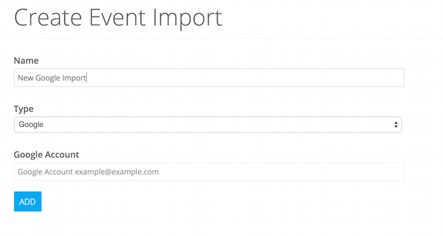

# Importing Events and Configuring Scrapers

### Types of Imports
Events can be imported via RSS, an API (with defined rules), a Google calendar URL or an iCal location.

## Getting events via scraping

### Using the Visual Selector
> The visual selector tool allows you to point and click at elements in the schema (title, description, date, etc.)  In some cases it can extract exactly what you want without any further work.

### URL parameters
> By utilizing URL variables, you can enable the scraping process to elegantly loop through paginated result sets.

* ```{page}``` - A basic incrementing page counter: 1,2,3,4,5 ...
* ```{page:X}``` - Will paginate by a certain multiplier.  This is most common for result sets that utilize a count per page and a ```start``` type parameter.  X represents the multiplier, so if you had a url that utilized a &start=20, &start=40 parameter, setting this to {{page:20}} would allow the scraper to iterate as such.
* ```{date:X}``` - Here, X represents a date format.
* ```{year}``` - Year in XXXX format
* ```{month}``` - Month in XX format
* ```{date}``` - Date in XX format

#### Examples:
Simple pagination:
```http://www.example.com/events?page={page}```

Offest & limit:
```http://www.example.com/events?start={page:25}&count=25```

Date:
```http://www.example.com/events/{year}/{month}/{date}```

### Scraping Manifests
> All scraping processes are defined by configuration files called 'manifests.'  These are JSON files that utilize the following structure

```json
{
    "name": "[Name of Import]",
    "method": "[HTTP Method, typically GET or POST]",
    "querystring": "[For POST, allows you to add form values]",
    "body": "[For POST, send body data]",
    "root-url": "[Starting URL]",
    "encapsulate-element": "[DOM element that matches events on a page]",
    "refine-encapsulate-element": "[DOM element that matches events on a details page]",
    "lookups": [
      {
        "name": "[name of lookup table]",
        "values": [
          {"input":"[text to compare]", "output":"[text to replace]"}
        ]
      }
    ],
    "rules": [
        {
            "field": "[name of field]",
            "element": "[DOM element of field]",
            "attribute": "[If the value is contained in an element's attribute]",
            "refine": "[true/false, whether this represents a link to a detail page]",
            "multiple": "[true/false, whether to retain all matches]",
            "filters": [
                {
                    "type": "[type of filter (see below)]",
                    "options": [
                        {
                        }
                    ]
                }
            ]
        }
    ],
    "refine-rules": [
        {
            "field": "[name of field]",
            "element": "[DOM element of field]",
            "attribute": "[If the value is contained in an element's attribute]",
            "refine": "[true/false, whether this represents a link to a detail page]",
            "multiple": "[true/false, whether to retain all matches]",
            "filters": [

            ]
        }
    ]
}
```
### Types of filters
Filters can be stacked and are called in the order they are defined.  As an example, if you have a title element that always matches Title:, you can use a ```textMustMatch``` filter to identify it, then a ```replace``` filter to strip text and a ```trim``` filter to remove space.  Those fields will be called in order.

* ```textMustMatch``` - Will only match elements that contain this text
* ```replace``` - Allows regular expressions
* ```composite``` - Accepts template-based declaration of field values.  In other words, if you had a date element and a time element and wished to combine into a single element, you could use ```{{date}} - {{time}}``` to produce this value.
* ```extract``` - Shorthand regex that allows you to isolate text in a field
* ```appendValue``` - Adds defined text at the end of the field
* ```prependValue``` - Adds defined text at the beginning of a field
* ```html2nl``` - Will replace ```div```, ```br```, ```hr```, ```p``` with newlines
* ```stripHTML``` - Removes HTML
* ```setVar``` - Allows current value of field to be copied into new dynamic field
* ```split``` - Allows turning a field value into an array by splitting by character
* ```javascript``` - Allows manipulation of current data using Javascript.  Current value is accessed by and stored as ```$V```
* ```lookup``` - Converts current value to predefined value using values from lookups

### Examples with options
#### textMustMatch
```{ "type": "textMustMatch", "value": "[text to match]", "options": []}```

#### replace
```{ "type": "replace", "options": ["find":"regex to find", "replace":"replacement string","noquote":(1|0)]}```
The option ```noquote``` is set to 1 if the ```find``` value should not be escaped.  For example, if you're using a regular expression with special characters such as \d, \w, {}, (), etc. 

#### javascript
```{ "type": "javascript", "value":"$V = $V.toUpperCase();" }```

## Getting events via Google Calendars
> Events can be imported using a Google Calendar email address.  Similar to scraped imports, these can be biased to a venue and/or category or multiple categories.


