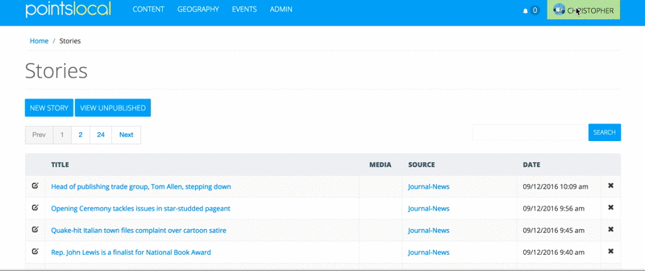

# Scraping With The Chrome Extension

## Getting the Extension

## Getting a site key
While you can use the extension to produce manifests without a site key, having one (or more) allows you to save and update scrapes directly from the extension itself.

To generate or retrieve your key, log into your Pointslocal admin and click *Profile*, which is under your username in the primary nav.  From there, you'll find a section labelled Scraper Extension Key.  Under this you'll find an existing key or the option to generate.
