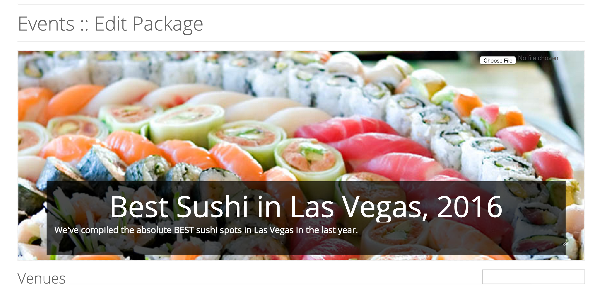

# Managing Editorial Packages
> This guide will show you how to build and manage editorial events packages.  This module allows you to create evergreen or timely collections or "listicles" of event, story and/or venue data.  Common usages are for "best of" packages, dining guides and holiday event guides.

## Creating a New Package

### The Header
The package header contains three simple components: a title, a subtitle or kicker and an optional background image.  This gives you a chance to quickly outline what the package consists of.

### Venues
If implemented, this section allows you to aggregate and order venues for a particular category.  This is useful for cuisine-specific dining guides, best music venues or best bars, etc.

### Events
The events section is usually used to provide time-sensitive curated lists of things to do for a certain period.  It can also be used to outline "evergreen" or non-date-specific things to do like "Swimming in Barton Springs" or "Take The Kids To MOMA"