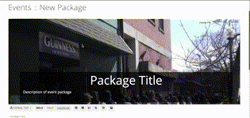

# Managing Editorial Packages
> This guide will show you how to build and manage editorial events packages.  This module allows you to create evergreen or timely collections or "listicles" of event, story and/or venue data.  Common usages are for "best of" packages, dining guides and holiday event guides.

## Creating a New Package

### The Header
The package header contains three simple components: a title, a subtitle or kicker and an optional background image.  This gives you a chance to quickly outline what the package consists of.

To edit the title and subtitle/description, you can simply start writing in the sections Package Title and Description of event package.

Directly beneath the header section, there is the text section. This allows you to write an editorial introduction to the listicle/content below.

### Venues
If implemented, this section allows you to aggregate and order venues for a particular category.  This is useful for cuisine-specific dining guides, best music venues or best bars, etc.

#### Example: Best Nightlife in Los Angeles
In this example, we generate a best-of list for nightlife (bars, clubs, parties) in L.A.

### Events
The events section is usually used to provide time-sensitive curated lists of things to do for a certain period.  It can also be used to outline "evergreen" or non-date-specific things to do like "Swimming in Barton Springs" or "Take The Kids To MOMA"

#### Example: Best Christmas Events
In this example, we're looking at a temporal listicle, one with a limited shelf-life.  Since all the events included are Christmas-related and bound to finite event, this content does not have a lot of ongoing value.

### Stories

#### Example: Best Concerts of 2015
In this example, we'll look at a retrospective collection of events, which allows you to turn otherwise stale, event-based content into something with more lasting edtiorial appeal.