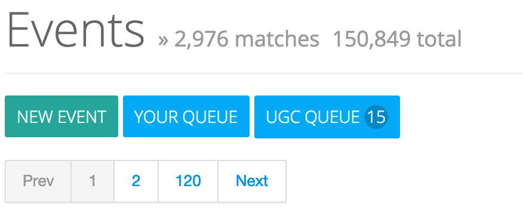

# Managing User-Generated Content

> This guide will show how to approve or reject user-generated event and venue information.  In addition, you'll learn how to create enable certain users to bypass default rules, such that most submissions would require approval and some could go straight to your live site.

## Finding User Submissions
Filtering your events list to just user-submitted events is simple - on any events list page it's available as a button:

The number in the circle indicates the # of events that do not yet have any action applied to them.  Typically those actions are setting a publish status, deleting the event or merging with an existing event.

## Setting Available and Required Custom Fields
To include custom fields (outside of Pointslocal's default set) in the user-generated form for event submission, see [Managing event fields](events_fields.md)

[comment]: <> (Blocking Users)

[comment]: <> (## Granting Users Higher Privilege)

[comment]: <> (## Inviting Users)

[comment]: <> (## Giving Users Control of Events and Venues)