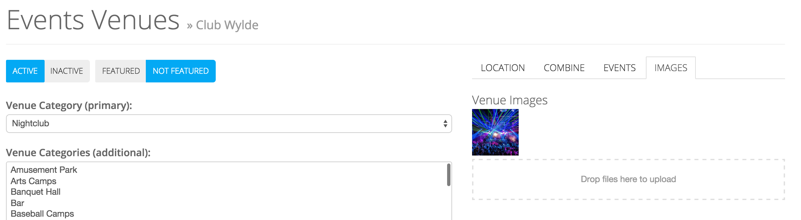

# Managing Venues
> This guide explains creation and management of venues and their metadata.

# Creating a Venue
To create a new venue, select "Event Venues" under "Events" in the nav and the click the "New Venue" button.

You'll be presented with a basic screen which enables you to add the absolute minimal amount of information - a title and optionally a geolocation.  If you intend to add an address and wish to have it geocoded exactly, you should skip this step.

# Editing a Venue

.. note::

    If the address associated with an event was unable to be geocoded, you may see a note at the top of the venue's editing page indicating such.  Check the syntax of the address and resave in this case.

# Venue Art
A venue can have any number of images associated with it.  These can be added from the Edit Event page under the Images tab.

To select art, either drag it from your desktop to the dashed area or click that area to bring up the file select dialog.  To reorder images, simply drag them into the desired position.  A primary venue image is the first one shown, but some image methods allow you to select a venue image at random, giving more a more dynamic appearance in search results or lists.

# Managing Custom Fields
In addition to pre-defined fields, you can also create custom fields, which will show on all venues or those wthin applicable categories.  This allows you to have category-specific fields like Menu for restaurants or Gallery Hours for museums.  These fields can represent data of almost any type: free text, a predefined list of values and even binary data for video/PDFs/audio.

# Managing Venue Categories
To add categories to a venue, a primary venue category can be added and/or a number of additional venue categories to the venue.