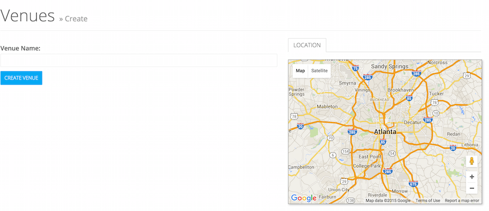

# Managing Venues
> This guide explains creation and management of venues and their metadata.

# Creating a Venue
To create a new venue, select "Event Venues" under "Events" in the nav and the click the "New Venue" button.

You'll be presented with a basic screen which enables you to add the absolute minimal amount of information - a title and optionally a geolocation.  If you intend to add an address and wish to have it geocoded exactly, you should skip this step.

# Editing a Venue

.. note::

    If the address associated with an event was unable to be geocoded, you may see a note at the top of the venue's editing page indicating such.  Check the syntax of the address and resave in this case.

# Venue Art

# Managing Venue Categories

<noscript>Please enable JavaScript to view the <a href="https://disqus.com/?ref_noscript" rel="nofollow">comments powered by Disqus.</a></noscript>